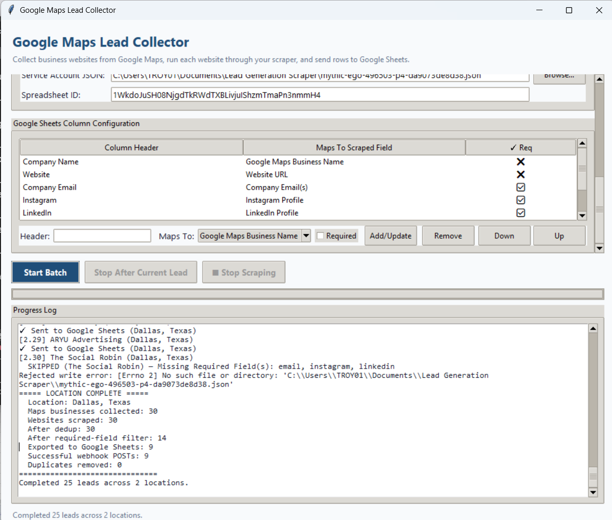
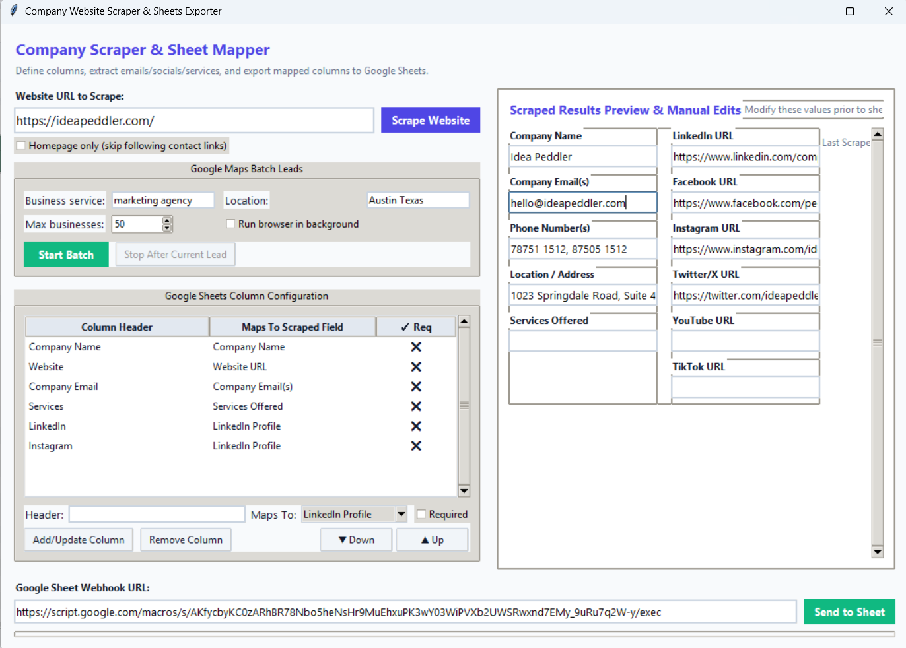
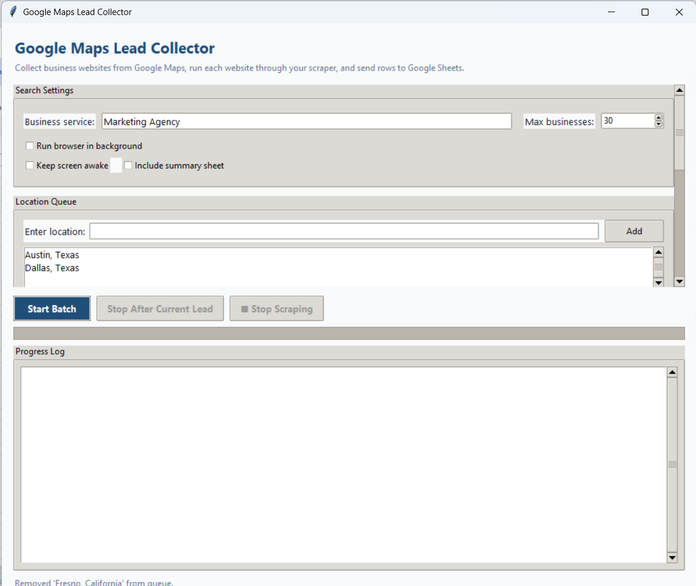
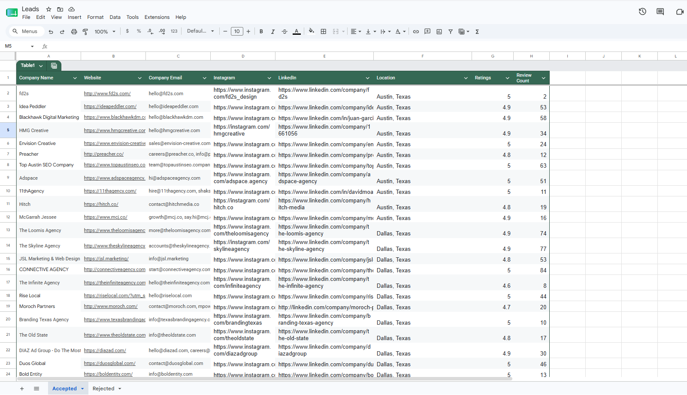
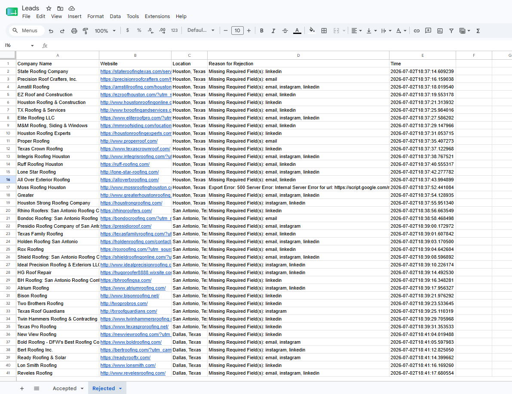

<p align="center">
  
</p>

<h1 align="center">Lead Generation Scraper</h1>

<p align="center">
  <b>Extract business contact data from company websites</b><br>
  Heuristic-based HTML parsing — no AI APIs required.
</p>

<p align="center">
  
  
  
</p>

---

## Overview

A Python toolkit with two complementary workflows for collecting business leads:

1. **Single-URL scraper** — Enter any business website and extract company name, email, phone, location, services, and social media profiles.
2. **Google Maps batch collector** — Search Google Maps for businesses by type and location, scrape each website found, and export qualified leads to Google Sheets.

Both workflows include a graphical interface (Tkinter), editable results, configurable column mapping, and Google Sheets integration. A CLI is also available for automation and scripting.

---

## Features

| Feature | Description |
|---|---|
| **Website scraping** | Extracts company name, email(s), phone(s), address, services, and social media links (LinkedIn, Facebook, Instagram, Twitter/X, YouTube, TikTok). |
| **Contact page discovery** | Automatically finds and follows contact/enquiry/support pages for richer data. |
| **Email obfuscation handling** | Decodes `[at]`, `(dot)`, and ` at ` patterns used to hide emails from scrapers. |
| **Multi-source email fallback** | If no email is found on the website, attempts extraction from the Facebook About page and LinkedIn company page. |
| **Service categorization** | Recognizes 15+ service categories (SEO, PPC, Social Media, Branding, etc.) using heuristic keyword matching. |
| **Google Maps lead collection** | Uses Playwright (Chromium) to search Google Maps, collect business listings with ratings and review counts, then scrape each website. |
| **Multi-location queue** | Run the same search across multiple cities in a single batch. |
| **Duplicate prevention** | Deduplication across locations within a run and across runs via a processed-leads cache read from Google Sheets. |
| **Required field validation** | Skip leads missing required data (e.g., no email) and log them to a Rejected sheet. |
| **Google Sheets export** | Two methods: a lightweight Apps Script webhook (no auth setup) or a gspread service account (cache loading, rejected tracking, summary reports). |
| **Configurable column mapping** | Map any scraped field to any column header, mark fields as required, reorder columns. |
| **Editable results** | Modify scraped data in the GUI before exporting. |
| **Graphical and CLI interfaces** | Tkinter GUI or terminal-based operation. |
| **Performance tuning** | Configurable concurrency (thread pool) and headless browser mode. |
| **Windows sleep prevention** | Keeps the system awake during long batch runs. |

---

## Technologies

| Technology | Purpose |
|---|---|
| **Python 3.10+** | Core language |
| **Custom HTMLParser** (stdlib) | Heuristic website scraping engine |
| **Playwright** | Headless Chromium browser for Google Maps automation |
| **BeautifulSoup 4 + requests** | Email fallback extraction (Facebook, LinkedIn) |
| **gspread + google-auth** | Google Sheets service account integration |
| **Google Apps Script** | Lightweight Sheets webhook |
| **Tkinter** | Graphical user interfaces |
| **ThreadPoolExecutor** | Concurrent website scraping |
| **PyInstaller** | Standalone Windows .exe packaging |

---

## How It Works

### Website Scraping Flow

1. Fetch the homepage (tries HTTPS first, falls back to HTTP).
2. Extract company name from meta tags → title → h1 → domain name.
3. Extract emails, phone numbers, location, services, and social links.
4. Find same-site contact links and repeat extraction on up to 3 contact pages.
5. If no email found, attempt the Facebook About page, then the LinkedIn company page.
6. Return all results as a structured dictionary.

The scraping engine uses a custom `HeuristicHTMLParser` subclass that:
- Strips script, style, and template elements
- Tracks navigation/header context to weight link importance
- Collects meta tags, headings, link text, and raw content
- Handles obfuscated email formats

### Google Maps Collection Flow

1. Navigate to `google.com/maps/search/{query}+{location}` in headless Chromium.
2. Scroll the results feed to load enough business listings.
3. Visit each business detail page to extract name, rating, review count, and website URL.
4. Run each collected website through the scraping engine.
5. Support parallel scraping via `ThreadPoolExecutor` (configurable worker count).
6. Save results to CSV or pass to the GUI for Google Sheets export.

---

## Project Structure

```
Lead Generation Scraper/
├── src/
│   ├── app.py                      # Core scraping engine (HTMLParser, extraction logic)
│   ├── gui.py                      # Single-URL scraper GUI (Tkinter)
│   ├── maps_website_collector.py   # Google Maps browser automation + batch scraping
│   ├── maps_batch_gui.py           # Maps batch collector GUI (Tkinter)
│   ├── sheets.py                   # Google Sheets integration (gspread + webhook)
│   ├── google_apps_script.gs       # Apps Script web app for sheet export
│   ├── tests.py                    # Unit tests for core extractors
│   ├── benchmark_scrape.py         # Parallel scraping benchmark tool
│   ├── measure_scrape.py           # Single-threaded scraping timer
│   ├── requirements.txt            # Core dependencies
│   ├── requirements-playwright.txt # Playwright-only dependencies
│   ├── run.bat                     # CLI launcher (Windows)
│   ├── run_gui.bat                 # Single-URL GUI launcher (Windows)
│   ├── run_maps_batch_gui.bat      # Maps batch GUI launcher (Windows)
│   └── maps_batch_gui.spec         # PyInstaller spec for .exe build
├── screenshots/                    # Application screenshots
├── logs/                           # Settings persistence + output CSVs
├── .gitignore
├── LICENSE
└── README.md
```

---

## Installation

### Prerequisites

- Python 3.10 or newer

### Setup

```powershell
# Clone the repository
git clone <repo-url>
cd Lead Generation Scraper

# Create and activate a virtual environment
python -m venv .venv
.\.venv\Scripts\activate

# Install core dependencies
pip install -r src\requirements.txt

# If using the Google Maps batch collector:
pip install -r src\requirements-playwright.txt
python -m playwright install
```

---

## Usage

### GUI — Single-URL Scraper

```powershell
.\src\run_gui.bat
```

Paste a company website URL, click **Scrape Website**, and the app populates editable fields for company name, email, phone, location, services, and social links. Modify any field before exporting to Google Sheets via the **Send to Sheet** button. The **Column Configuration** panel lets you define which columns to export and how they map to scraped fields.

### GUI — Google Maps Batch Collector

```powershell
.\src\run_maps_batch_gui.bat
```

1. Enter a business service (e.g., "marketing agency") and configure max results.
2. Add one or more locations to the queue (e.g., "Austin, Texas").
3. Configure column mappings and set required fields.
4. Click **Start Batch** to begin collection, scraping, and export.

### CLI — Single URL

```powershell
python src\app.py https://example.com
```

Use `--homepage-only` to skip following contact page links:

```powershell
python src\app.py https://example.com --homepage-only
```

Output is JSON:

```json
{
  "company_name": "Example Corp",
  "email": ["hello@example.com", "sales@example.com"],
  "services": ["SEO", "Websites", "Branding"],
  "phone": ["+1 (555) 123-4567"],
  "location": "123 Main Street, Suite 400, Austin, TX 78701",
  "linkedin": "https://www.linkedin.com/company/example",
  "facebook": "https://facebook.com/example",
  "instagram": "https://instagram.com/example",
  "twitter": "",
  "youtube": "",
  "tiktok": "",
  "all_socials": "https://www.linkedin.com/company/example, https://facebook.com/example",
  "timestamp": "2026-07-07 14:30:00"
}
```

### CLI — Google Maps Batch

```powershell
python src\maps_website_collector.py "marketing agency" "Austin Texas" --max-results 30
```

Options:

| Flag | Description |
|---|---|
| `--skip-scrape` | Collect website URLs only (no per-website scraping) |
| `--headless` | Run the browser in the background |
| `--workers N` | Set concurrent scraper threads (default: 10) |
| `--output FILE` | Output CSV path (default: `maps_leads.csv`) |

### Running Tests

```powershell
python src\tests.py
```

---

## Screenshots

| Single-URL Scraper GUI | Maps Batch Collector | Column Configuration |
|---|---|---|
|  |  |  |

| Accepted Sheet | Rejected Sheet |
|---|---|
|  |  |

---

## Google Sheets Integration

Two methods are supported:

### Method 1: Apps Script Webhook (simpler)

1. Open your Google Sheet, go to **Extensions → Apps Script**.
2. Paste the contents of `src/google_apps_script.gs`.
3. Deploy as a **Web app** (execute as `Me`, access `Anyone`).
4. Copy the Web App URL into the application's webhook field.

The Apps Script creates an **Accepted** sheet (or uses the active sheet) and appends rows with whatever column headers you configure.

### Method 2: Service Account (advanced)

1. Create a Google Cloud service account and enable the Sheets API.
2. Download the JSON key and share your spreadsheet with the service account email.
3. Set the **Service Account JSON** path and **Spreadsheet ID** in the Maps Batch GUI.

This enables duplicate prevention (caches processed leads), rejected-lead tracking, and optional summary reports.

---

## Future Improvements

- Bulk URL import (upload a CSV of URLs to scrape)
- Progress indicator for the single-URL scraper
- Environment variable configuration documentation
- Type hints across all modules
- `pyproject.toml` for `pip install -e .` support
- GitHub Actions CI pipeline

---

## License

[MIT](LICENSE)

---

<p align="center">
  Built with Python • Playwright • Tkinter
</p>
